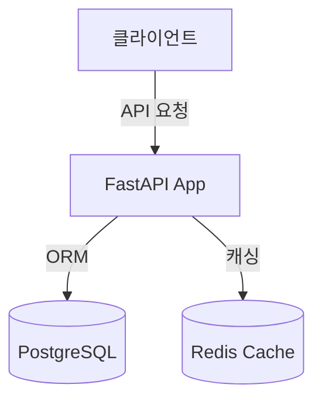

# 🚀 Jekyll 포트폴리오 작성 가이드

이 프로젝트는 Jekyll의 **[Just the Docs](https://just-the-docs.github.io/just-the-docs/)** 테마를 기반으로 한 문서화 형식의 포트폴리오 템플릿입니다. 깔끔한 사이드바 네비게이션과 강력한 검색 기능, 그리고 마크다운을 지원하여 개발 이력과 프로젝트 상세 내용을 정리하기에 매우 적합합니다.

포트폴리오를 효과적으로 구성하기 위해 **어디에 어떤 문서를 작성해야 하는지**에 대한 가이드를 정리해 드립니다.

---

## 📁 주요 디렉토리 구조 및 역할

포트폴리오의 각 메뉴와 내용은 주로 `docs/` 디렉토리 하위에 마크다운(`*.md`) 파일로 생성하고 관리합니다.

```text
jak010.github.io/
├── _config.yml             # ⚙️ 사이트 전역 설정 (제목, 설명, 테마 색상 등)
├── index.md                # 🏠 포트폴리오 메인 대문 (자기소개)
├── docs/                   # 📄 포트폴리오 상세 문서 폴더
│   ├── experience/         # 💼 경력 (회사 및 업무 경험)
│   ├── projects/           # 🛠️ 프로젝트 경험 (상세 기술 분석, 아키텍처)
│   ├── skills/             # 🛠️ 기술 스택 상세 (백엔드, 데이터베이스 등)
│   └── docs/layouts...     # ℹ️ (테마 예제 파일들 - 커스텀 후 삭제 가능)
└── assets/                 # 🖼️ 이미지, PDF 이력서 등 정적 파일 위치
```

---

## ✍️ 추천 문서 배치 및 작성 가이드

포트폴리오를 풍성하게 채우기 위해 아래와 같은 문서 구조로 작성하시는 것을 추천합니다.

### 1. 메인 대문 및 자기소개 (`index.md`)
*   **경로**: 루트 디렉토리의 [index.md](file:///Users/jako/private/portpolio/jak010.github.io/index.md)
*   **역할**: 방문자가 사이트에 접속했을 때 처음 마주하는 공간입니다.
*   **포함할 내용**:
    *   핵심 슬로건 및 요약된 자기소개 (현재 잘 작성해 두셨습니다 👍)
    *   연락처 정보 (Email, GitHub Link, Tech Blog 등)
    *   전체 포트폴리오 문서의 구조 안내 또는 PDF 이력서 다운로드 링크

### 2. 기술 스택 상세 (`docs/skills/`)
단순한 기술 명열(Java, Python 등)을 넘어 **해당 기술을 어떻게 깊이 있게 활용했는지**를 기록합니다.
*   **추천 파일**:
    *   `docs/skills/backend.md` (FastAPI, SQLAlchemy, Python 활용 능력 및 깊이)
    *   `docs/skills/database.md` (RDB 최적화 경험, NoSQL 등)
    *   `docs/skills/devops.md` (Docker, CI/CD, AWS 등 인프라 경험)
*   **작성 팁**: "FastAPI 사용 가능"보다는 "FastAPI를 활용해 비동기 API 서버를 구축하고, SQLAlchemy의 관계 지연 로딩 문제를 해결해 조회 성능을 X% 개선함"과 같이 구체적인 경험 위주로 작성하세요.

### 3. 프로젝트 이력 (`docs/projects/`)
참여한 대표 프로젝트들의 아키텍처, 기술적 도전 과제, 해결 과정(Troubleshooting)을 작성합니다.
*   **추천 파일**:
    *   `docs/projects/project-a.md` (첫 번째 프로젝트)
    *   `docs/projects/project-b.md` (두 번째 프로젝트)
*   **작성 팁**:
    *   **프로젝트 개요**: 기간, 본인 역할, 사용 기술 stack
    *   **아키텍처 구조**: Mermaid.js(하단 가이드 참고)를 활용한 인프라/데이터 흐름도
    *   **핵심 기여 및 성과**: 수치 기반 성과 (예: 응답 속도 개선, 트래픽 처리량 향상 등)
    *   **트러블슈팅**: 마주했던 가장 어려던 문제와 이를 해결하기 위해 취했던 검증 과정 및 해결책

### 4. 회사/경력 이력 (`docs/experience/`)
*   **경로**: `docs/experience/experience.md`
*   **역할**: 재직했던 회사별 근무 기간, 주요 역할, 부서별 주요 성과를 시간 순으로 정리합니다.

---

## 🛠️ Just the Docs 네비게이션(Nav) 설정법

각 마크다운 파일의 최상단에는 **Front Matter**(YAML 블록)를 설정하여 사이드바 메뉴 구조를 정의해야 합니다.

### 예시 1: 상위 메뉴 설정 (예: Projects 대문)
```yaml
---
layout: default
title: Projects          # 사이드바에 표시될 이름
nav_order: 3             # 사이드바에서 노출될 순서 (작을수록 상단)
has_children: true       # 하위 문서가 있음을 표시
---
```

### 예시 2: 하위 문서 설정 (예: 특정 프로젝트 상세)
```yaml
---
layout: default
title: FastAPI 커뮤니티 서버  # 문서 제목
parent: Projects             # 상위 메뉴의 title과 정확히 일치해야 함
nav_order: 1                 # Projects 메뉴 내부에서의 노출 순서
---
```

---

## 💡 문서 시각화를 돕는 테마 핵심 기능

마크다운 내에 아래 문법들을 활용하면 포트폴리오가 훨씬 전문적으로 보입니다.

### 1. 콜아웃 (Callouts) - 중요한 성과나 경고 표시
`just-the-docs`는 예쁜 알림 상자를 지원합니다. 핵심 성과나 트러블슈팅 포인트에 적용해 보세요.

```markdown
> [!IMPORTANT]
> **핵심 성과**
> - API 응답 속도 평균 **30% 단축** (500ms -> 350ms)
> - SQLAlchemy N+1 쿼리 문제를 `joinedload` 도입으로 해결하여 DB 커넥션 부하 제거
```

### 2. 코드 블록과 복사 버튼
코드 예제나 설정 파일을 보여줄 때 유용합니다. 사이트에 복사 버튼이 기본 활성화되어 있습니다.
```python
# 예시 코드
@app.get("/items/{item_id}")
async def read_item(item_id: int):
    return {"item_id": item_id}
```

### 3. Mermaid.js - 아키텍처 다이어그램 그리기
텍스트로 흐름도나 아키텍처를 시각화할 수 있습니다. `_config.yml`에 mermaid가 활성화되어 있어 바로 사용할 수 있습니다.



---

## 💻 로컬에서 확인하며 작성하기

문서를 작성하면서 실시간으로 변경 사항을 확인하려면 로컬 터미널에서 다음 명령을 실행합니다.

```bash
# 의존성 설치 (최초 1회)
bundle install

# Jekyll 로컬 서버 실행
bundle exec jekyll serve
```
실행 후 브라우저에서 `http://localhost:4000`에 접속하여 실시간 반영 결과를 확인할 수 있습니다.
