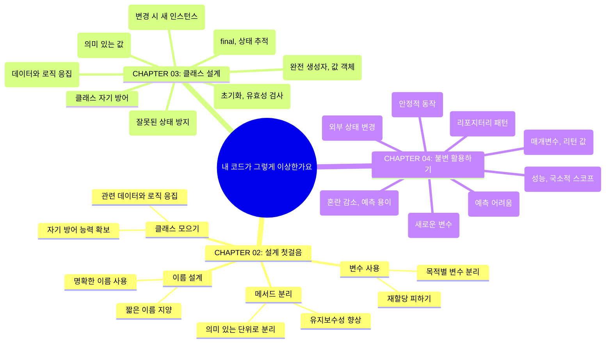

# TL; DR;

> 이 노트는 "내 코드가 그렇게 이상한가요" 라는 책을 일으며 정리한 내용과 그에 대한 생각 및 지식을 정리하기 위해 작성된 노트입니다.

  

# CHAPTERS
> 챕터 정리

[CHAPTER 00, 내 코드가 그렇게 이상한가요](/categories/book/is_my_code_really_that_weird)  
[CHAPTER 02, 설계 첫 걸음](/categories/book/is_my_code_really_that_weird/ch02)  
[CHAPTER 03, 클래스 설계 : 모든 것과 연결되는 설계 기반](/categories/book/is_my_code_really_that_weird/ch03)  
[CHAPTER 04, 불변 활용하기 : 안정적으로 동작하게 만들기](/categories/book/is_my_code_really_that_weird/ch04)  
[CHAPTER 05, 응집도 : 흩어져 있는 것들](/categories/book/is_my_code_really_that_weird/ch05)  
[CHAPTER 06, 조건분기 : 미궁처럼 복잡한 분기 처리를 무너뜨리는 방법](/categories/book/is_my_code_really_that_weird/ch06)  
[CHAPTER 07, 컬렉션 : 중첩을 제거하는 구조화 테크닉](/categories/book/is_my_code_really_that_weird/ch07)  

# Mind Maps

