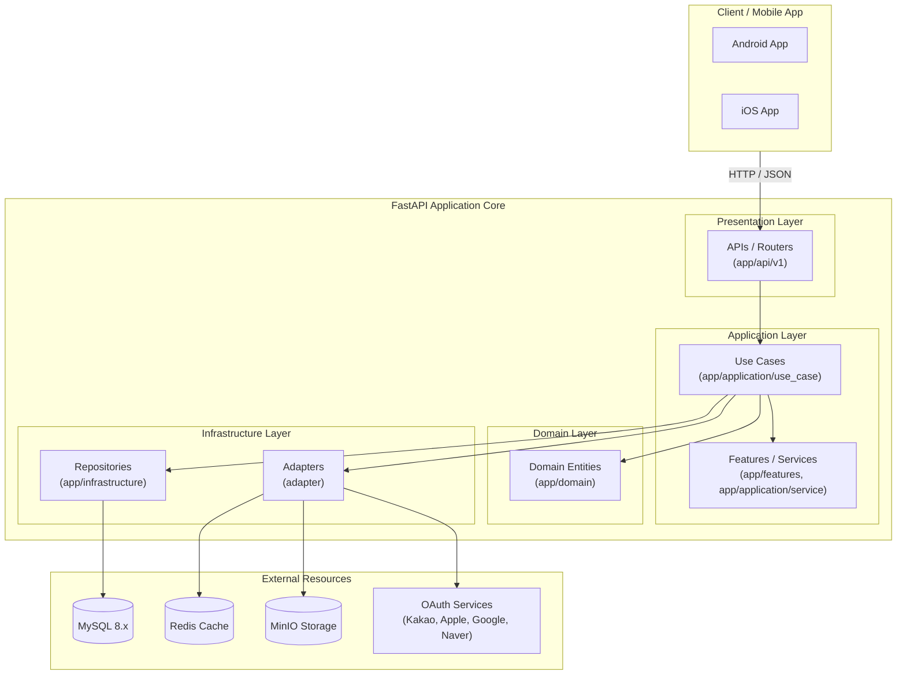

# 팟팟 (PodPod)
{: .no_toc }

## 목차
{: .no_toc .text-delta }

1. TOC
{:toc}

---

## 프로덕트

### 개요

| 서비스 소개 | PodPod은 K-POP 아티스트의 콘서트에 동행할 메이트를 연결해주는 서비스입니다. |

### 구성

| 항목 | 내용 |
| :--- | :--- |
| **참여 인원** | 총 5명 |
| **팀 구성** | PO(Mobile) 1명, 기획 1명, 디자이너 1명, 마케팅 1명, BE 1명 |
| **진행 기간** | 2025.12 ~ 진행중 |
| **담당 역할** | BackEnd API 개발 및 아키텍처 설계 |
| **협업 도구** | • **GitHub**: 소스코드 형상 관리 및 개발 프로세스 공유 • Jira: 개인 태스크 관리 • Notion: 개발 문서 및 프로젝트 이력 관리 |

### 성과

| 특징        | 상세 내용                                                                                                                                                                                                                                                                        |
| :-------- | :--------------------------------------------------------------------------------------------------------------------------------------------------------------------------------------------------------------------------------------------------------------------------- |
| **Android&iOS App 출시** | • **문제**: 많은 사이드 프로젝트가 개발 단계에서 종료되어 실제 사용자에게 서비스를 제공하지 못하는 경우가 많았습니다.  • **해결**: 팀원들과 협업하여 서비스 개발부터 운영 환경 구축, 모바일 앱 연동까지 완료하고 출시 가능한 수준으로 프로젝트를 완성했습니다.  • **성과**: **Google Play Store와 Apple App Store에 서비스를 성공적으로 출시**하여 실제 사용자에게 서비스를 제공하는 단계까지 프로젝트를 완수했습니다. |

## 프로젝트

### 저장소

| 구분 | 저장소 링크 (Repository) | 주요 역할 및 기능 |
| :--- | :--- | :--- |
| **API 서버** | 대외비 | 대외비 |
| **기타 모듈** | 대외비 | 대외비 |

### 기술 스택

| 분류                | 상세 내용                                                                               |
| :---------------- | :---------------------------------------------------------------------------------- |
| **담당 역할**         | BackEnd API 개발 및 서버 아키텍처 설계                                                         |
| **사용 언어**         | Python 3.12 ~ 3.14                                                                  |
| **프레임워크 & 라이브러리** | FastAPI, Uvicorn, SQLAlchemy, Pydantic, aiomysql, dependency-injector, Pytest, Ruff |

### 개발 환경 및 인프라

| 분류               | 상세 구성 내용                                                     |
| :--------------- | :----------------------------------------------------------- |
| **컨테이너 환경**      | Docker                                                       |
| **웹 서버**         | Nginx (Reverse Proxy & Load Balancer), Uvicorn (ASGI Server) |
| **데이터베이스**       | MySQL 8.x                                                    |
| **캐시**           | Redis 7.x                                                    |
| **오브젝트 스토리지**    | MinIO                                                        |
| **네트워크 및 보안**    | Cloudflare(DNS 및 Proxy), HTTPS, Infisical(Secret Management) |
| **개발 환경 관리**     | Make, `.env`, Git & GitHub                                   |
| **테스트 및 품질 관리**  | Pytest, Ruff                                                 |
| **모니터링 및 장애 대응** | GlitchTip(Sentry 호환), Slack API 실시간 알림                       |

### 주요 기능

| 기능 | 상세 내용 |
| :--- | :--- |
| **소셜 로그인 및 계정 관리** | • **통합 인증**: 구글, 애플, 카카오, 네이버 소셜 로그인 및 이메일 로그인 수단을 하나의 세션 발급 API로 통합하여 JWT 토큰을 발행합니다.  • **회원/토큰 관리**: 액세스 토큰 재발급(Refresh)과 회원 정보(프로필) 수정, 약관 동의, 회원 탈퇴 프로세스를 지원합니다. |
| **아티스트 및 콘서트 스케줄 관리** | • **아티스트 정보**: 등록된 K-POP 아티스트 목록과 개별 상세 정보를 제공합니다.  • **월별 일정**: 아티스트의 월별 콘서트, 방송 등의 일정을 캘린더 형태 조회가 가능하도록 월별/상세 단위로 조회합니다.  • **등록 제안**: 사용자가 신규 아티스트 등록을 제안하고, 투표 순위를 실시간 산출하는 기능을 제공합니다. |
| **동행 팟(Pod) 개설 및 메이트 매칭** | • **팟(Pod) 운영**: 콘서트 동행 모집을 위한 방(팟)을 생성, 수정, 삭제, 마감 처리할 수 있습니다.  • **동행 신청 및 승인**: 동행을 희망하는 사용자는 참여 신청서를 생성하여 제출하고, 팟 개설자는 이를 승인 혹은 거절하여 메이트를 최종 선발합니다.  • **메이트 상호 리뷰**: 동행 완료 후 메이트들의 매너 점수와 피드백을 상호 평가하여 신뢰도 지표(상호 리뷰)를 형성합니다. |
| **실시간 채팅 및 소통** | • **채팅 메시지**: 동행 팟 멤버 간 실시간 채팅방을 제공하며, 메시지 전송 및 이전 메시지 내역(페이지네이션) 조회를 지원합니다.  • **채팅방 제어**: 읽음 처리와 함께 채팅방 나가기(멤버십 유지), 종료된 팟의 채팅방 목록 숨김 처리 등을 제공합니다. |
| **선호도 설정 및 성향 테스트** | • **선호 아티스트**: 사용자가 선호하는 아티스트를 설정하여 개인화된 스케줄 및 팟 매칭 우선순위를 결정합니다.  • **성향 진단**: 동행 메이트들의 성향 조사를 위한 설문을 제공하고, 성향 테스트 결과를 조회하여 매칭 추천 데이터로 활용합니다. |
| **통합 알림 및 사용자 제어** | • **실시간 알림**: 팔로우, 신청서 리뷰 완료, 채팅 수신 등에 대한 알림 조회, 개별/일괄 읽음 및 삭제 처리를 지원합니다.  • **관계 및 신고**: 타 사용자를 팔로우하거나 알림 음소거를 개별 설정하고, 불량 사용자에 대한 신고 및 차단/차단 해제 기능을 제공합니다. |

---

## 시스템 아키텍처

### 인프라 아키텍처
- TBD

### 애플리케이션 아키텍처

이 프로젝트는 외부 기술 변경에 유연하게 대응하고, 데이터베이스 및 프레임워크(FastAPI) 등 인프라 기술의 변경이 핵심 비즈니스 로직을 오염시키지 않도록 레이어를 격리한 **Clean/Hexagonal 아키텍처**를 목표로 구현하고 있습니다.

#### 아키텍처 주요 특징

1. **비즈니스 로직 보호와 테스트 용이성을 위한 의존성 격리**
   - 웹 프레임워크나 외부 데이터베이스 기술 스펙의 변경이 핵심 비즈니스 로직에 주는 파급 효과를 차단하고자, 클린 아키텍처 의존성 규칙의 완전 격리를 목표로 설계했습니다. 이를 통해 세부 인프라 구현 없이 핵심 도메인의 작동 원리와 비즈니스 룰만을 독립적으로 검증할 수 있는 단위 테스트 환경을 조성하고자 했습니다.
2. **느슨한 결합과 결합도 최소화를 위한 의존성 주입(DI) 컨테이너 도입**
   - 모바일 클라이언트와 다각적인 타사 API 연동, 데이터베이스 액세스 등의 인프라 모듈 결합도를 제어하고자 `dependency-injector`를 통한 동적 주입 구조를 구축했습니다. 런타임 구현체의 유연한 교체와 Mocking 객체의 손쉬운 주입 환경을 목표로 삼았으며, 궁극적으로 통합 테스트의 신뢰도를 확보하려 했습니다.
3. **확장성과 응집도를 고려한 패키지 및 레이어링 전략**
   - 핵심 비즈니스(아티스트, 팟 동행 매칭 등)의 시나리오 정합성 유지를 위해 수직적 유스케이스로 강하게 분리하되, 도메인에 얽매이지 않고 재사용이 잦은 영역(팔로우, 지역 데이터 등)은 수평적 피처(`app/features/`)로 유연하게 분산 조립할 수 있게 하여 기능 추가 시 아키텍처적 유연함을 갖추는 데 주력했습니다.
4. **스펙 일원화와 커뮤니케이션 오버헤드 최소화를 위한 Shared 모듈 격리**
   - 모바일(Android, iOS) 클라이언트 개발자와의 API 규격 합의 과정에서 발생하는 사양 불일치 리스크를 최소화하고자 DTO용 `shared/schemas`와 DB 연동용 `shared/models`를 공통 분리 정의하였습니다. 개발 내 중복되는 스키마 및 DTO 선언을 최소화하고 명확한 데이터 검증 규칙을 유지하는 것을 지향했습니다.

---
