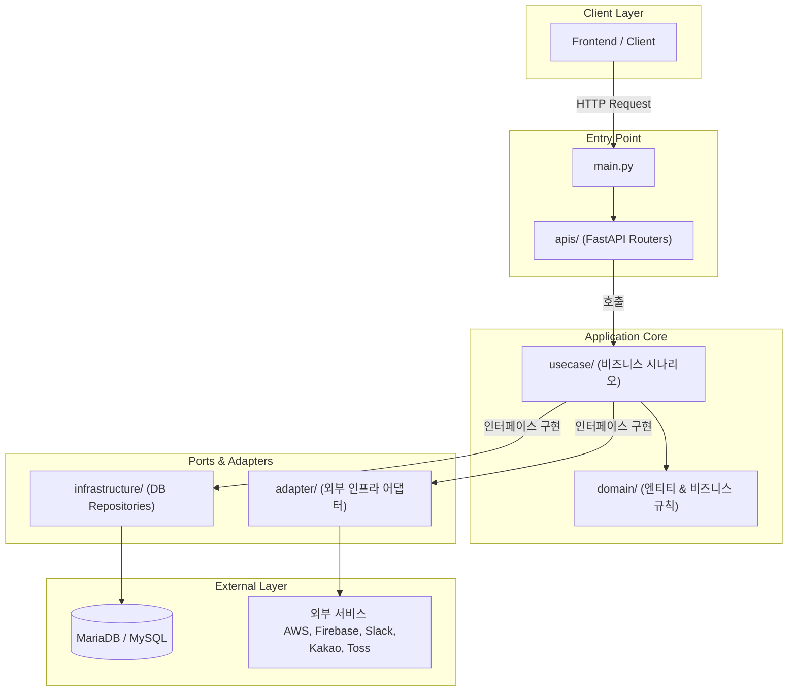

# 품앗이 (Poomasi)
{: .no_toc }

`FastAPI` `Gemini 1.5 Flash` `Clean Architecture` `Hexagonal Architecture` `VPC Subnet 격리` `Terraform` `GitHub Actions` `Locust`

## 목차
{: .no_toc .text-delta }

1. TOC
{:toc}

---

>  관련 포스팅
- 2025-11-10, [품앗이, FastAPI에 적용했던 두 가지 포인트](https://jakpentest.tistory.com/475)
- 2025-11-04, [품앗이, FastAPI 아키텍처 어떻게 가져갈 것인가?](https://jakpentest.tistory.com/473)
- 2025-11-03, [JWK로 OAuth2 토큰 검증하기](https://jakpentest.tistory.com/472)
- 2025-11-03, [품앗이, 사이드 프로젝트를 정리하며](https://jakpentest.tistory.com/471)

## 프로덕트

### 개요

| 서비스 소개 | IT 취준생에게 현업 선배를 연결해주는 **대학생 멘토링 플랫폼**임. |
| :--- | :--- |
| **핵심 목표 1** | 사용자들(IT취준생)이 검증된 현업 멘토와 교류하고, 신뢰도 높은 학업 및 취업 조언을 얻을 수 있는 정보 공유 게시판과 소통 커뮤니티 환경을 제공받도록 구성하는 것을 목표로 함. |
| **핵심 목표 2** | 주요 IT 기업들의 채용 정보를 실시간으로 자동 수집하고, LLM을 통해 채용 요건(경력, 직무, 핵심 기술 등)을 정밀하게 추출·분류하여 대학생 맞춤형 멘토 매칭 데이터를 구축하는 것을 목표로 함. |

### 구성

| 항목 | 내용 |
| :--- | :--- |
| **참여 인원** | 총 4명 (PO/PM 1명, 디자이너 1명, BE 1명, FE 2명) |
| **진행 기간** | 2025.02 ~ 2025.11 (약 8개월) |
| **담당 역할** | 백엔드 기능 개발 및 데이터 수집 인프라 구축 |
| **협업 도구** | • **Slack**: 팀 내부 소통 및 실시간 알림 연동 • **Jira**: Sprint 기반 일정 및 세부 태스크 관리 • **Notion**: 기획 안, 스펙 명세, 개발 및 API 문서 통합 관리 • **Swagger (OpenAPI)**: API 스펙 공유 및 프론트엔드 협업 환경 구성 |

### 성과

| 특징 | 상세 내용 |
| :--- | :--- |
| **주요 IT 기업 채용 데이터 수집 자동화 시스템 구축** | • **문제**: 기업별 채용 사이트마다 제공 방식과 데이터 구조가 달라 신규 채용 정보를 일관된 형태로 수집하기 어려움. • **해결**: 7개 IT 기업 채용 사이트를 분석하고 HTML 크롤링, 공개 API, 내부 JSON API 등 기업별 방식에 맞는 수집 모듈을 구현함. 수집 데이터를 공통 DTO 형태로 변환하고 채용공고 ID와 기업 정보를 기준으로 중복 데이터를 방지하도록 설계함. • **성과**: 약 2,500건 이상의 채용공고 데이터를 서비스에서 활용 가능한 형태로 자동 수집·관리하는 데이터 파이프라인 구축을 목표로 함. |
| **Gemini 기반 채용공고 기술스택 자동 추출 시스템 구축** | • **문제**: 채용공고 내 기술 요구사항을 사람이 직접 확인하고 서비스 매칭 데이터로 변환하는 과정이 필요함. • **해결**: Gemini 1.5 Flash 모델과 Prompt Engineering을 활용하여 채용공고 제목 및 설명에서 사전에 정의된 기술스택 포함 여부를 자동 판단하도록 구현하고, 결과를 내부 기술스택 데이터셋과 검증하는 후처리 로직을 적용함. • **성과**: 약 70~80개의 기술스택 데이터를 기준으로 채용공고 분석 과정을 자동화하여 멘토 매칭 서비스에 활용 가능한 데이터 구축을 달성함. |
| **확장 가능한 백엔드 아키텍처 설계 및 구현** | • **문제**: 서비스 기능 확장과 외부 서비스 연동 증가에 대비해 비즈니스 로직과 인프라 계층의 결합도를 낮출 필요가 있었음. • **해결**: Clean Architecture 기반으로 API, Application, Domain, Infrastructure 계층을 분리하고 dependency-injector를 활용해 Repository 및 외부 서비스 의존성을 관리함. • **성과**: 데이터베이스, 외부 API 등 구현 세부사항이 핵심 비즈니스 로직에 영향을 주지 않는 구조를 구축하여 유지보수성과 확장성을 확보함. |
| **검색 엔진 최적화(SEO)를 통한 플랫폼 유입 극대화** | • **문제**: 서비스 마케팅 예산이 부족한 사이드 프로젝트 환경에서, 구글 검색을 통한 자연 신규 사용자 유입 경로(Organic Traffic) 확보가 절대적으로 요구됨. • **해결**: 채용공고 및 멘토 프로필 페이지에 Open Graph와 JSON-LD 스키마 마크업을 동적으로 반환하는 SEO 메타데이터 파이프라인을 구축하고, 일별 신규 데이터 수집 시 `sitemap.xml`을 자동 생성 및 웹마스터 도구에 전송하는 배치 환경을 조성함. • **성과**: 관련 핵심 키워드('기술스택별 IT 멘토링', '신입 개발 채용 요약') 검색 시 **구글 첫 번째 페이지 최상위 노출**을 달성하여 유기적 사용자 유입 활성화에 기여함. |

## 프로젝트

### 저장소

| 구분 | 저장소 링크 (Repository) | 주요 역할 및 기능 |
| :--- | :--- | :--- |
| **API 서버** | [be-poomasi-api](https://github.com/poomasi/be-poomasi-api) | Clean/Hexagonal Architecture 기반 멘토링 매칭 및 플랫폼 핵심 API 개발 |
| **스케줄러 & 크롤러** | [be-poomasi-scheduler](https://github.com/poomasi/be-poomasi-scheduler) | 7개 IT 기업 채용 데이터 수집 크롤러 및 Gemini 기반 기술 스택 요구사항 분석 배치 개발 |
| **인프라 IaC** | [poomasi-infrastructure](https://github.com/poomasi/poomasi-infrastructure) | Terraform을 이용한 전체 AWS VPC, EC2, ALB, RDS 등 클라우드 리소스 구성 선언적 코드 정의 |

### 기술 스택

| 분류 | 상세 내용 |
| :--- | :--- |
| **담당 역할** | 백엔드 API 개발 및 크롤러/분류 배치 시스템 구축 |
| **사용 언어** | Python 3.12 |
| **프레임워크 & 라이브러리** | FastAPI, SQLAlchemy 2.x, APScheduler, dependency-injector, google-generativeai (Gemini), firebase-admin, locust, PyMySQL, Slack SDK |

### 개발 환경 및 인프라

| 분류 | 상세 구성 내용 |
| :--- | :--- |
| **클라우드 인프라 (AWS)** | EC2, RDS (Aurora MySQL), ELB (ALB), Route53 |
| **애플리케이션 서버** | EC2 (t2.micro) 내 uvicorn + gunicorn 프로세스 구동 |
| **데이터베이스** | Amazon Aurora MySQL (VPC Private Subnet 격리 구성) |
| **네트워크 및 보안** | ALB 로드 밸런싱, Route53 DNS 연동, Certificate Manager(ACM)를 통한 SSL/TLS 인증 |
| **IaC (인프라 프로비저닝)** | Terraform 기반 클라우드 리소스 구성 선언적 코드로 형상 관리 |

### 주요 기능

| 기능 | 상세 내용 |
| :--- | :--- |
| **멘토링 플랫폼 API 개발** | 회원가입/로그인, 인증 및 인가, 멘토·멘티 관리, 채용공고 조회, 매칭 관련 API 등 서비스 핵심 백엔드 기능 개발 |
| **채용공고 데이터 자동 수집 시스템 구축** | 네카라쿠배당토 등 7개 IT 기업 채용 사이트 구조를 분석하고 HTML 크롤링, 공개 API 호출, 내부 JSON API 분석 방식으로 채용 데이터를 자동 수집 |
| **채용 데이터 표준화 및 중복 관리** | 기업별 상이한 채용 데이터를 공통 DTO 형태로 변환하고, 채용공고 ID와 기업 정보를 Unique Key로 활용하여 중복 저장 방지 |
| **LLM 기반 기술스택 분석 자동화** | Gemini 1.5 Flash와 Prompt Engineering을 활용하여 채용공고 제목 및 설명에서 사전에 정의된 기술스택 포함 여부를 자동 분석 |
| **채용 데이터 배치 운영 관리** | APScheduler 기반 배치 시스템을 구축하고 일별 수집 채용공고 수 및 신규 등록 기술 키워드를 로깅하여 데이터 변화 모니터링 |

---

## 시스템 아키텍처

### 인프라 아키텍처

*   **네트워크 및 보안 인프라 구조**:
    *   **VPC 환경 구성**: AWS VPC 내에서 서비스 영역을 논리적으로 분리하고 외부 인터넷 게이트웨이와 로드밸런서(`ALB`)를 경유하도록 구성함.
    *   **서브넷 이중화**: 외부 접근이 가능한 Public Subnet에 FastAPI 서버 인스턴스(`EC2`)를 배치하고, 핵심 데이터베이스는 Private Subnet의 `RDS`로 완전히 격리하여 보안을 대폭 강화함.
    *   **글로벌 인프라 관리**: Route53을 통한 도메인 및 DNS 연동, Certificate Manager(ACM)를 통한 SSL/TLS 인증서 관리와 S3 저장소 연동을 제공함.
*   **실시간 트래픽 흐름**:
    *   사용자가 웹 프론트엔드(`poomasi-prod-web`)로 접속하면 `ALB`를 거쳐 VPC Public Subnet 내의 `EC2` API 서버로 요청이 전달되며, API 서버는 내부 네트워크망을 통해 Private Subnet 내의 데이터베이스(`RDS`)와 안전하게 데이터를 주고받는 흐름을 구성함.
*   **자동화된 CI/CD 배포 파이프라인**:
    *   **지속적 통합(CI)**: 개발팀이 GitHub에 소스 코드를 반영하면 **GitHub Actions**가 자동으로 트리거되어 웹 및 API 서버 소스 코드를 빌드하고 검증함.
    *   **지속적 배포(CD)**: 백엔드 API(`be-poomasi-api`)와 수집 스케줄러(`be-poomasi-scheduler`)는 SSH 보안 통신 프로토콜을 활용해 `EC2` 인스턴스로 자동 배포함.
    *   **코드 기반 인프라 정의(IaC)**: 전체 AWS 인프라 리소스 설정(`poomasi-infrastructure`)은 **Terraform**을 이용해 선언적 코드로 형상 관리하고 클라우드 인프라 변경 배포를 자동화함.

### 애플리케이션 아키텍처
이 프로젝트는 영속성 기술과 외부 프레임워크로부터 핵심 비즈니스 로직을 보호하고 테스트 용이성을 극대화하기 위해 **Clean/Hexagonal Architecture (포트 & 어댑터 패턴)** 구조로 설계함.

*   **의존성 규칙(Dependency Rule) 준수를 통한 도메인 보호**: 모든 의존성이 외부에서 내부(도메인 방향)로만 향하도록 구성하여 외부 프레임워크나 데이터베이스 기술 스펙이 변경되더라도 비즈니스 로직(Application Core)은 오염되지 않고 독립적으로 유지되도록 함.
*   **인프라스트럭처와의 결합도 해소**: `usecase` 레이어가 인터페이스(Port)를 바라보며 동작하도록 개발하고, 구체적인 영속성 기술(`SQLAlchemy` 기반 리포지토리) 및 외부 연동 기능(Gemini, Firebase 등)은 런타임에 동적으로 주입(DI)되는 포트 & 어댑터 구조 구성을 목표로 함.
*   **각 레이어별 핵심 역할**:
    *   **EntryPoint (`apis`)**: 클라이언트 요청의 진입점으로, FastAPI 라우터와 DTO 스키마 검증을 처리하도록 개발함.
    *   **ApplicationCore (`usecase`, `domain`)**: 실제 비즈니스 유스케이스 시나리오와 핵심 도메인 비즈니스 엔티티를 포함하도록 순수 비즈니스 레이어로 격리함.
    *   **Ports & Adapters (`infrastructure`, `adapter`)**: 데이터베이스 엑세스나 외부 타사 API(Slack, Firebase, Toss 등) 연동을 전담 구현하도록 하여 핵심 비즈니스 로직과 물리적으로 완전 분리함.

---

## 기타 사항
*   **Locust를 활용한 부하 성능 테스트**:
    *   동시 접속자 수(Number of Users): 100명
    *   램프업(Ramp-up) 시간: 10초
    *   평균 초당 처리량(RPS AVG): 160
*   **협업 효율성 개선**:
    *   일관된 커밋 메시지 관리를 위해 AI 플러그인을 활용한 Commit Message 템플릿 적용함.
